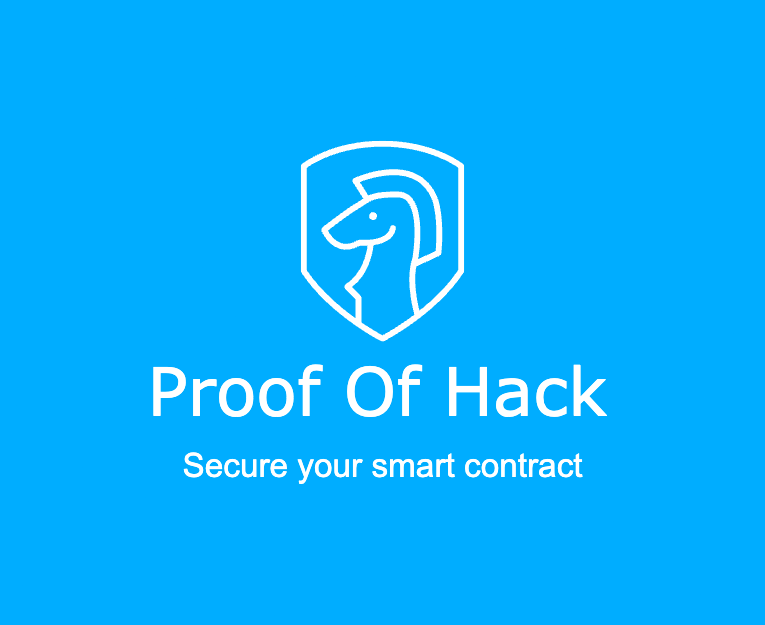
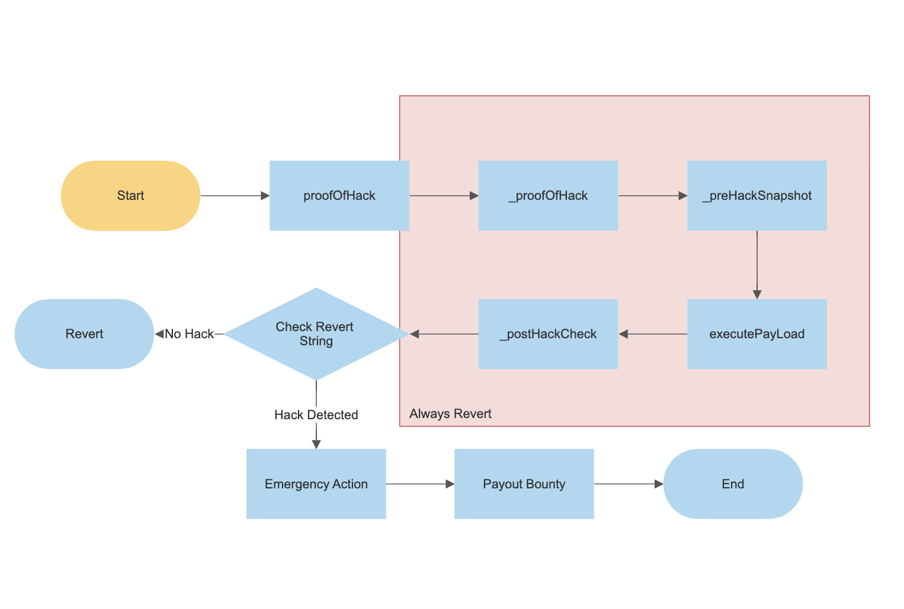

# Proof Of Hack

Proof of Hack is a EthGlobal Paris 2023 hack that enables whitehat hackers and security researchers to demonstrate their ability to identify vulnerabilities in a protocol without actually exploiting them. When a hack is proofed an emergency action can be triggered, such as a pause, to protect the asset and prevent any potential damage. This can include a guaranteed payout to the whitehat to provide incentives.

## Why
- Hacks are bad
- Causes damage even when funds are returned
- Whitehat hate being downplayed by projects

## Feature
- Easy to implement, inherit the contract and override a few function to define the "hack" condition
- The exploit is simulated onchain without actually commiting the states

## Usecase
- Whitehat can secure protocols in prod with guaranteed payout
- MEV searcher can frontrun hacker and secure the protocol

## How
- The payload is executed and reverted with "success"/"fail" based on the defined hack condition
- Subsequent actions are triggered based on the revert string

## Example
1. UpOnly.sol
This is a simple contract with an increment only counter, where it is "hacked" if the counter decremented, and would trigger a pause when that happens.

2. POHSafeModule.sol
Instead of implementing on the protocol, this can also inplemented as a Safe module where it trigger an action as the safe when the hack condition is met. For example, here we trigger a pause from the Safe (owner of the UpOnly contract) 
